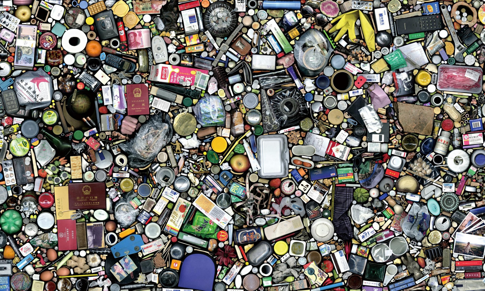
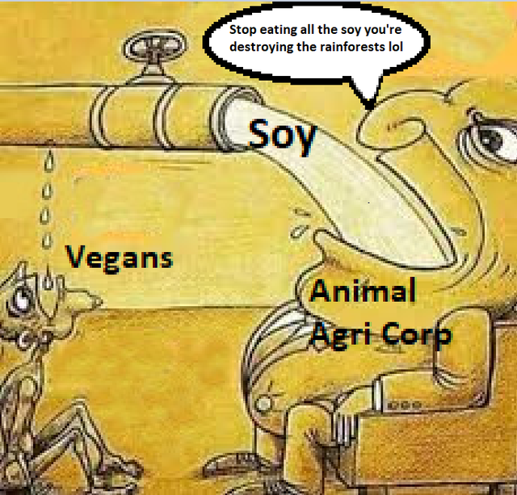
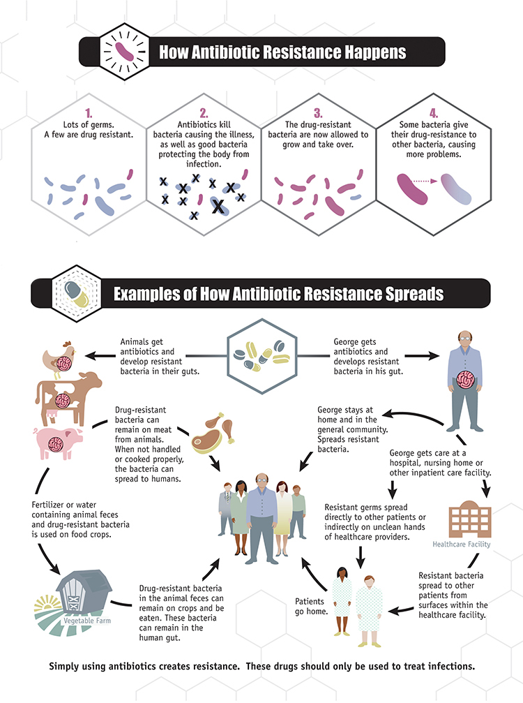
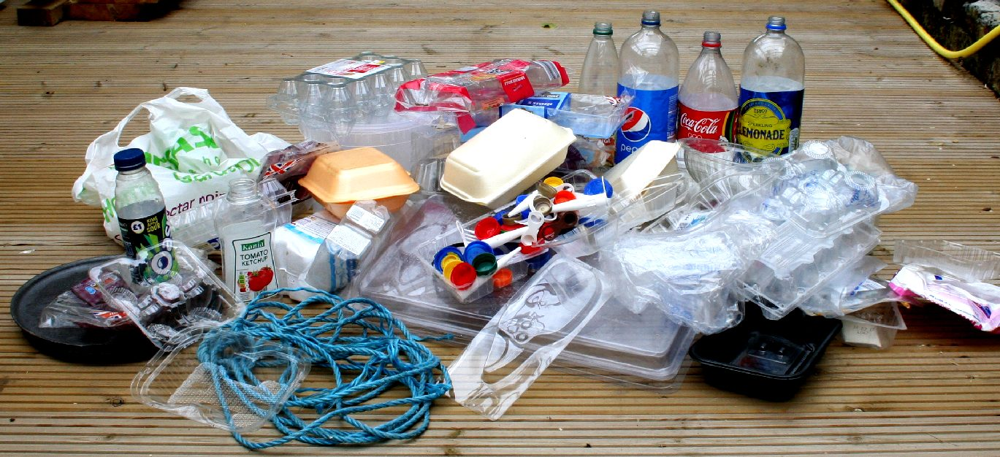
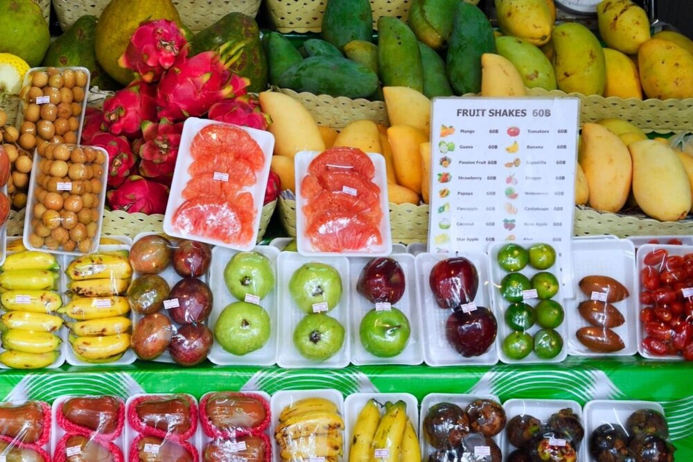

# Problémy

Všechny environmentální problémy úzce souvisí. Jeden způsobuje druhý, druhý způsobuje první a
třetí a tak dále. Jde o jakýsi velmi začarovaný kruh, který nás rychleji a rychleji
posílá ke zkáze. Každým rokem kvulí naší činnosti vyhubíme desetitisíce druhů
živých organismů. Postupně ničíme jednou dokonalé, ale nyní křehké ekosystémy, jako domino,
padající dál a dál až jednoho dne zjistíme, že už ani pro nás nic nezbylo.

V tomto článku se pokusím popsat ty největší problémy, s tím že vždy zkusím navrhnout nějaké možné
řešení.

## Přelidnění

Lidé se stali dominantním druhem na naší planetě a tak si s ní nyní děláme,
co chceme. Místo toho, aby jsme žili v symbióze s přírodou, jsme pro ní spíš
predátorští paraziti ničící vše okolo. Naše nynější způsoby fungování to totiž
vyžadují. Ve výhledné době rozhodně nemůžeme očekávat úbytky populace,
spíše naopak. Osobně si ale myslím, že přelidnění nemusí být zase takový problém,
pokud by jsme vyřešili problémy níže.

## Konzumerismus

Ideální stav společnosti nastane v momentě, kdy mají všichni postavený dům,
nějaké nástroje, oblečení a základní prostředky nutné k životu. Většina
těchto věcí byla vyrobena tak, aby nějaký čas vydržela. V tomto stavu už
lidé nemusí produkovat v takovém rozsahu - lidem stačí jen příležitostně
nahrazovat nějaké nefunkční věci. Bohužel v naší dnešní společnosti máme
problém. Naučili jsme se, že musíme neustále nahrazovat a kupovat nové
věci, i když pro náš život nejsou vůbec nutné. Do našeho způsobu myšlení jsme
si zakódovali jakousi představu, že musíme mít nové věci, aby jsme byli šťastní.
V ideální společnosti se nemusí věčně produkovat, ale protože my jsme si
zavedli věci jako móda, která se mění každý rok, lidem se zdá, že musí
chodit pravidelně řádit do obchoďáku, aby měli aktuální kousky. Přestože
od mala miluju techniku a počítače, mám pocit, že se to samé děje s elektronikou.
Věci jako iPhone či grafické karty mají každý rok nový model, a lidi mají pocit,
že je nutně potřebují - já třeba používám okolo 10 let staré počítače a jsem
spokojený, protože upřímně, činnosti co děláme na počítačích se během
20ti let zas tak nezměnili. Na vánoce mají rodiče pocit, že musí koupit dětem
hory hraček a je jim jedno, že děti to stejně po nějakém čase omrzí.
Pointa je, že toto konzumní myšlení nedělá společnost o moc šťastnější -
producent musí pracovat mnohem víc v podstatě beze smyslu, spotřebitel je po koupi
nového kousku šťastný na velmi krátkou dobu, a po krátkém čase tu věc stejně vyhodí.
Díky konzumnímu myšlení je nyní celý náš ekonomický systém postaven na dvěma
neudržitelnými a desktruktivními pilíři: myšlenka nezastavující se produkce a
myšlenka nekončícího růstu. Toto vytváří celou řadu problémů. Nejenom to množství
práce, která je nutná vykonávat prakticky zbytečně, ale také množství zdrojů naší planety,
z kterého si každý den ukrojujíme neuvěřitelně velké sousto. Lidstvo počítá s
nekonečným čerpání těchto zdrojů, pár jedinců z toho teď má nějaký
vysoký krátkodobý zisk.
Tyto zdroje nám ale planeta nemůže nekonečně poskytovat a tak se za pár desítek let
ukážou důsledky našeho chování a následky pocítí každý z nás.

Řešení otázky přehnaného konzumerismu je složité. Myslím si, že jde především o
individuální změny, aby každý z nás změnil svůj způsob myšlení. Dále by mohlo pomoct
prosadit regulace zakazující firmám používat metody [plánovaného zestarávání](https://cs.wikipedia.org/wiki/Pl%C3%A1novan%C3%A9_zastar%C3%A1v%C3%A1n%C3%AD) -
jde o způsoby, jak vynutit spotřebitelům nahradit starý produkt za nový. Například v EU je
od roku 2021 zakázáno používat tzv. kazítka ve spotřební elektronice. Ale musíme zajít dál -
je potřeba dělat elektroniku tak, aby se dala používat desítky let. Měli by jsme si třeba vynutit
vyměnitelné baterie u chytrých telefonů a tak dále. Nyní se bojuje za
takzvané [právo na opravu](https://en.wikipedia.org/wiki/Electronics_right_to_repair), které
by umožnilo lidem opravovat svá vlastní zařízení. V dnešní době se totiž většina elektroniky
vyrábí tak, aby bylo nevýhodné až nemožné ji opravit, a tak si musíte koupit nový model.

Existuje také sociopolitická ideologie [anti-konsumerismu](https://en.wikipedia.org/wiki/Anti-consumerism),
která se zabývá všemi těmito otázkami.

> It’s time to build an economy and a culture centered on connection rather than consumption; on boosting the well-being of
people and the planet rather than creating more "stuff" and more waste.

[Zdroj a nápady jak s tím může začít každý z nás](https://newdream.org/topics/consumerism)

## Neefektivní způsoby stravování

Jíst musíme, a tak by mělo být v našem nejlepším zájmu jíst tak, aby jsme tím nic
nepoškozovali.

Na zemi je hlad.
[Každou hodinu umírá 300 dětí](https://data.unicef.org/topic/child-survival/under-five-mortality/).
[Polovina z nich zemře kvůli tomu, že trpí hladem.](https://data.unicef.org/topic/nutrition/malnutrition/#)
Globální hlad je často zjednodušován jako problém nedostatku (nemáme dost jídla), nebo problém
distribuce (lidi nemají přístup k jídlu). Na papíře ale vidíme, že produkujeme tolik kalorií,
které by mohli nakrmit 10+ miliard lidí. Kam ty kalorie mizí? Více než třetina
vyprodukovaných kalorií je použita na krmení zvířat, což je taky jeden z důvodů, proč máme zároveň
nadbytek kalorií a nedostatek jídla pro lidi. Problém je tedy v něčem větším než v logistice
a distribuci. [Zvířata jsou vysoce neefektivní konvertoři živin.](https://awellfedworld.org/feed-ratios/)
Konzumují víc krmiva než produkují jídla pro nás. Také jsou náročnější na zdroje, vyžadují víc
prostoru, vody a energie, než kdyby jsme jedli přímo rostlinné potraviny. A odpad v důsledku chovu je
také enormní. Jenom v USA je každou sekundu vyprodukováno 50 tun zvířecích exkrementů. To způsobuje
znečištění půd, řek a oceánů. V roce 2014 existovalo v oceánech asi 500 mrtvých zón, ve který je
tolik dusíku z hnojiv a exkrementů, že tam žádný živočich nepřežije. Nyní těchto míst přibývá víc a víc.

Co z toho vyplývá? Mnoho globalních kalorií "navíc" je redistribuováno od těch, kteří je
potřebují nejvíc pro ty, kteří za ně můžou dát nejvíc peněz. Jídlo pocházející ze zvířat je
tak formou nadspotřeby, která snižuje globální dostupné množství jídla zvyšováním ceny
základních potravin, které jsou pak využity jako krmivo. (krmivo vs. jídlo)

Věděli jste, že chování zvířat má na klimatickou změnu větší vliv než celá logistika naší zeměkoule?
Tím myslím letadla, lodě, auta - celkem masakr.

Důvody proč nejíst maso a další živočišné produkty:

1. Již zmíněná neefiktivita, tím daná větší zátěž životního prostředí,
než alternativy
2. Etické a moralistické otázky
3. [Jezení živočichů způsobuje pandemie](https://www.eatinganimalscausespandemics.com/).
Tím, že musíme zvířata na maso chovat ve velkochovech se u nich častěji a jednodušeji
rozšiřují onemocnění především bakteriálního, ale i virového typu. Nyní se to řeší tak, že se zvířata
krmí antibiotikami ve velkém. Bakterie se ale stávají [odolnými](https://journals.asm.org/doi/full/10.1128/mBio.02227-15),
což nám otevírá cestu do pekla. Zdá se, že pandemie jako ta nynější budou v [budoucnu](https://microbiologysociety.org/blog/antimicrobial-resistance-the-next-pandemic.html) stále častější
záležitostí, jak virového tak i bakteriálního původu.

4. Zdraví - Dieta založená na mase zvyšuje [krevní tlak, zvyšuje šanci na zástavu srdce](http://www.emro.who.int/world-health-days/2013/nutrition-hypertension-factsheet-whd-2013.html) a
[zvyšuje šanci k rozvinutí rakoviny](https://www.thelancet.com/journals/lanonc/article/PIIS1470-2045(15)00444-1/fulltext)

Důvody proč jíst maso:

1. Víc zapadnete do společnosti, ale to je hlavně podle toho, v jaké
bublině lidí žijete
2. "Víc vás to zasytí", takže se najíte, pak nejste chvíli schopní
nic dělat (spíš nevýhoda), nejradši byste šli spát, a pak to trávíte
v podstatě celý zbytek dne
3. Trochu menší přípravy - Maso stačí koupit a tepelně opracovat,
kdežto luštěninu ještě k tomu musíte dát přes noc do vody

Výhody proč přejít na rostlinnou stravu jako společnost:

1. Teoreticky nakrmíme víc lidí po celém světě
2. Jednodušší cesta k zero wastu a
redukce odpadu - suché plody oproti masu nepotřebují plastové obaly,
nejsou náchylné k infekcím a jsou trvanlivější
3. Zvýšení veřejného zdraví,
část řešení problémů s antibiotickou resistencí
4. Minimalizace škod na životním prostřeí
5. Pěstování: Stále velký prostor pro technologickou inovaci
(precizní zemědělství, hydroponie, vertikální farmaření)

Mýty proč jíst maso a nebýt veg\*:

1. Málo bílkovin, nebudou ti růst svaly
	- Když jíte luštěniny (fazole čočka cizrna), výrobky ze sój́i a oříšky, bílkovin máte až až.
	- Tento falešný dojem dle mě pochází ze představy
	jednotvárné české kuchyně,
	 že vegetariánské jídlo je masité jídlo bez masa - takže
	 příloha k masu a zelenina. Bohužel takové bezmasé obědy
	 teď jím ve školní jídelně, takže se po zbytek dne musím
	 hodně snažit dostat do sebe bílkoviny, které potřebuju
2. Vitamíny a minerály
	- Když jíte rozmanitě, tak by to mělo být OK, jenom si musíte
	nastudovat co obsahuje co aby jste měli všeho dostatek
	- Když nemáte čas, je potřeba brát doplňky stravy
3. Ze sóji rostou prsa
	- XDDD
	- Tohle lidi říkají, protože v ní je "estrogen"
	- Jde ale o estrogen rostlinného typu, který úplně funguje
	jinak než živočíšný estrogen, ženský hormon

Líbil se mi film ["The game changers"](https://gamechangersmovie.com/),
je o sportovcích a kulturistech co jí rostlinnou stravu. Byli
tam taky vyvráceny ty klasické mýty.

## Celková rozežranost, vykořisťování rozvojových zemí a jejich přírodních divů

Toto zase hodně souvisí s předchozími body. Globalizace tak nějak způsobila, že si
můžeme dát kdykoli co chceme. My v rozvinutých zemích si to teda můžeme dovolit.
Postupně zjišťuji, že snad každá exotická potravina co si rád koupím v obchodě má na svědomí
něco špatného.

Možná jste slyšeli šílenství s palmovým olejem, ale..

Je libo čokoláda? Kvůli kakau si v západní Africe vykáceli 90% deštného pralesa a stále
v tom pokračují.
Ranní káva? Tak ta je na tom podobně.
Sója, avokáda, banány.
Z toho není zrovna dobrá nálada.
Zbývá jenom doufat, že když je na tom logo Fairtrade nebo Rainforest Alliance, bude to OK.
Ale je tomu opravdu tak? Už mnohokrát bylo zjištěno, že tyto certifikace jsou vlastně jen
další reklamní tah.

Tento problém bych shrnul takto: Lidé měli velkou poptávku po exotických produktech. Tato poptávka
za normálních okolností nemohla být uspokojena nabídkou, a tak by cena byla mnohokrát vyšší, než jsme
teď zvyklý. Co se ale stalo? V rozvojových zemích jsme udělali všechno proto, aby byla nabídka větší.
Kácíme pralesy, vyženeme druhy, započneme 6. vymírání, aby jsme tam zasadili to, na co má západní
obyvatel zrovna chuť. Můžeme za to vinit místní obyvatele? Ne, kdyby to neudělali, neměli by co jíst.
Jejich vládu? Pak by zas neměli co jíst jejich obyvatelé. Ale možná kdyby zavedli přísnější ochranu
těch přírodních hotspotů, tak by to bylo OK.

Příjde mi moc jednoduché tyto problémy svést na nějaký
určitý subjekt. Vždy jde o jakousi poptávku, kterou způsobujeme i my, zámořní Evropané.

Docházím k závěru, že nejekologičtější je v ČR takzvaná komunistická dieta
- každý den zemáky, cibulačna, kysané zelí, zavařené okurky atd.
Lokální výroba je přece jenom nejvíc udržitelná. Ale taková dieta už fakt neni nic pro mě.

## Odlesňování

Přímý důsledek předchozího bodu. Zhoršuje a zrychluje klimatickou změnu, a jak už jsme psal,
ničí biodiverzitu, a způsobuje vymírání zvířat.

## Znečišťování ovzduší

Když čechovi řeknete pojem ekologie, představí si tohle. Je to něco, co děláme a vidíme přímo tady v Česku,
čímž se podílíme na klimatické změně.

Auta vypouštějící CO2. Mají nás zachránit elektrické auta, která nabijeme elektřinou z uhelných elektráren.
Potom přejdeme na obnovitelné zdroje, s tím že výroba těch solárů dost možná
udělá víc škody než nám tady přinesou zelenosti.

Za mě je tento problém strašně složitý a nemá nějaký jasný krok co musíme udělat.
Já doufám, že nás zachrání technologický pokrok. Pokud ne, tak se budeme muset uskromnit.
Pokud by jsme vyřešili problém konzumerismu, myslím že by jsme dokázali vyžít pouze s obnovitelnými zdroji.

## Zbytečná produkce odpadu

Někdy je to volbě co koupit/nekoupit, nenechávat si zabalit jídlo v restauraci a tak.
Individuální záležitost.

Ale často je to i chyba prodávajícího.

Možná si myslíte "Vždyť to nic není, oni to zrecyklují." Není tomu tak. Celé je to taková lživá kampaň
na spotřebitele, která na nás přenáší vinu za znečišťování naší planety.
Plasty, co jsou recyklovány, jsou převážně PET flašky, zbytek většinou končí na skládkách, v oceánech,
nebo ve vzduchu.
[Video](https://youtu.be/Fiu9GSOmt8E)

Prosím, hlavně nekupujte vodu v PET flaškách.

Já se snažím plasty na jedno použítí vůbec nebrat, ale často to prostě nejde - Žiji v malém městě,
a všechny obchody s potravinama tady balí do plastu. Samozřejmě, kdyby tu byl nějaký bezobalový obchod,
tak bych do něho chodil.

Mým snem je vybudovat nějaký zelený obchodní řetězec, kde půjde všechno dát do vašich vlastních obalů,
a všechny potraviny budou pěstovány nějak udržitelněji.

## Znečišťování oceánů a ničení jejich ekosystémů

O tom už se mi ani nechce psát. Do oceánů pouštíme látky, které ho dělají kyselejší, tak umřou
korálové útesy, zrychlíme tak zase oteplováníčko,
rybám se nedaří, pouštíme tam plast, které oni jí, který je zabíjí, který sní, které
sníme my, takže v sobě máme plast, jsme z plastu,. Fishing fishing fishing, overfishing. Bycatch.
Vyhubení ohrožených ryb i neryb. Ryb míň a míň? Chovy lososů jsou ale OK, že? Ale krmíme je rybami, takže
fishing overfishing! Číňani všechno vylovili, tak jedou jejich masivní vraždostroje lovit, vše
vylovit, do teritorií jiných států. Ekosystémy se opět hroutí? Hroutí.

Představa průměrného Čecha o tom, jak funguje rybaření je jeho kámoš Tonda co chytá s prutem
na rybníku. V realitě je to ale tak, že se vezme loď, na ni se dá obrovská síť která pochytá
všechno chráněné nechráněná a jako bonus s sebou kompletně strhne a vezme mořské dno, čímž vznikají
další mrtvé zóny, nyní jen trochu jinak. Věděli jste, že mořské dno absorbuje
20 krát víc CO2, než deštný prales? 93% všeho CO2 je uchováváno v oceánu! A my tento oceánský
prales na mořském dnu ničíme a to neuvěřitelnou rychlostí 4000+ fotbalových hřišť za minutu!
Pro porovnání, odlesnňování na povrchu země běží rychlostí asi 27 fotbalových hřišť za minutu.
A potom tu obrovskou síť prostě odvázají a nechají ji tam, v oceánu - A hádejte z čeho je - no
z našeho oblíbeného plastu. Rybolov používá tolik rybářských sítí, že by se nima dala obmotávat
celá zeměkoule 500 krát denně.

Častá mylná představa problému znečišťování oceánu je ta, že do něho házíme plastová brčka, což zabíjí
buhví co, třeba želvy. Věděli jste ale, že komerční rybolov v USA každoročně zabije 250000 mořských
želv jako vedlejší úlovek? To je 250 krát víc, než co má za svědomí všechen plast,
co je ve světových oceánech.

Ale ryby jsou přece zdravé!

Řešením je asi jedině přestat jíst ryby. Omega 3 mastné kyseli jsou v rybách díky tomu, že jí řasy.
Ty řasy by jsme teoretiky mohli jíst přímo my. V česku to ale není moc dostupná záležitost.

## Klimatická změna

Přímý důsledek všeho konání o kterém jsem tu dosud psal. Nejhorší na tom je, že
je to zase další začarovaný kruh. Čím bude země víc oteplená, tím víc budou výrazné problémy,
které ji způsobují. Pokud ovšem něco nezměníme.

# Závěr

Tak, tohle byl můj pokus shrnout největší problémy našeho světa. Určitě jsem na spoustu věcí
zapomněl. Budu rád, když mi napíšete do komentářů o vašich poznatcích.

Na závěr bych chtěl říct - Prosím neupadejte do deprese a pocitu bezmoci. My jsme přeci
jenom ta generace, která dostane příležitost něco změnit. Nenechávejme to opět na naše děti.
Já bych chtěl třeba mít zelený obchůdek, někdo jiný se může dostat do politiky, aby prosadil
nějaké regulace a zrušil dotace na neudržitelné podniky, vědci zas můžou hledat způsoby,
jak dělat věci udržitelnějšími.

Bude to těžké, ale já v tom vidím obrovské dobrodružství, výzvu. A myslím si, že když si každý
najdeme to svoje, tak to společným úsilím nějak zvládneme. Tak, jak to má lidstvo ve zvyku.

Děkuji za přečtení :)
