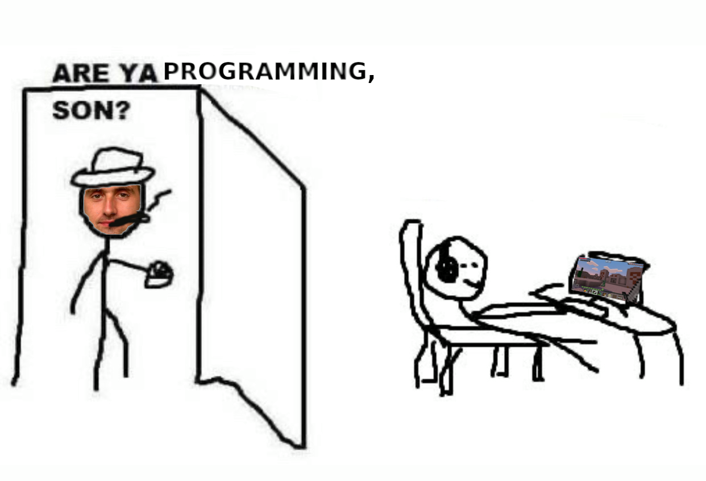
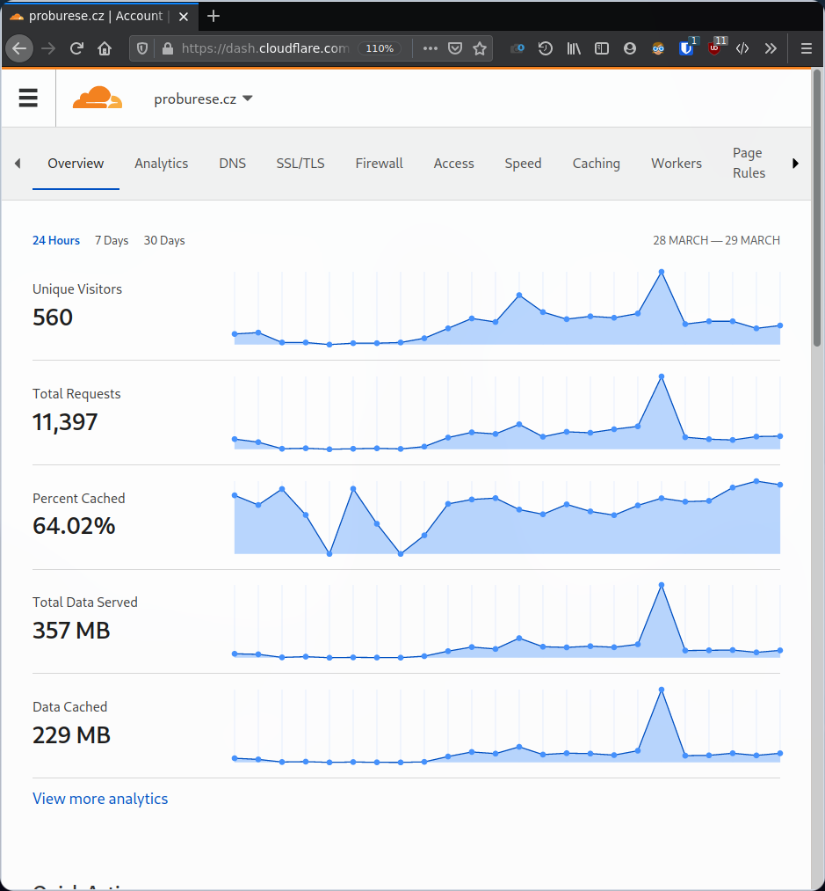

# The idea

So approximately three weeks ago some people
started sending tons of small donates to our
governing partys transparent account. And they
always write a funny/hate message in the payment details.

See, elections in Czechia are approaching.
They'll start in a half of a year from now.
And some poeple are very pissed of the current goverment.
It's not just the corrupt prime minister. Now it's also the fact that
we are "best in covid" and many lives have been lost because of it.

Two weeks ago my dad told us about these funny moments. He
laughed at them again and again lol. One day he would come to me
and he was like:

And he was like:
> Hey, I found the [API endpoint](https://www.kb.cz/transparentsapi/transactions/4070217?skip=0)
of the bank where you can view the donates!
Don't you want to write a python script that scrapes it and saves it
to a SQLite databse file, so we can have the messages saved
even when they delete the account?

So I thought about it for a while and then I was like:
> Hmm, fuck it, I am gonna build a full-blown fullstack thing where
you can view and search the donates!

> Hmm, and what about the ability to upvote/downvote? So people
will find the best messages!

(You know because... Most of the messages were just boomer rants
written in caps lock)

# Building it

So I picked up the most trendy millenial technologies that I
never used but seemed cool. No PHP! No Javascript - typescript ftw!
Also... fuck REST, GraphQL is the way!!! You know, all the trendy things that
programming youtubers use (ben awad). I still haven't picked up Docker,
so i still deploy using the good old scp/rsync boomer way.

The first day I figured a nice Node module "typeorm" that
maps objects to whatever db system you want. Really good thing.
So when I knew how to handle the DB, i've easily make the scraping
program and also I started the frontend project using Nuxt.js and
Buefy CSS framework. The default template looks suited just fine
so I didn't touch CSS at all, just changed the color to some
brown/orange shade.

The next day I wrapped my head about GraphQL, I used a node module
called type-graphql thats also really nice once you get a
hang out of it.

When I was coding it my mom was like:
> Be careful, close the curtains, what if some Babis's agent shoots you
through the window??

(Don't worry guys, luckily we don't have it as bad here -
but what about russia for example? press F for the russians)

Then I was figuring out how to save user likes, so the user cannot just
hit F5 and hit like again. I tried it using local storage which I thought
would be easy but easily abusable but whatever. But it didn't work
at all for some reason so I dumped that. So I decided I will store
the likes matched to users on the server.

Then I used the passport.js library to make a Facebook OAuth login, which
worked really well. So when you login with facebook, it has to
save your session into cookies. This work is done by the express-session module.
Then I didn't know at all how to pass the user
session information to the graphql resolvers, but eventually
I've came across the solution (some apollo server contexts)

At that point I already know how to use the technologies,
so I just crafted all the resolvers and frontend stuff like a ninja.

## Looking back at it and review of trendy tech

When I started crafting the site all using Node.js and typescript,
I was really confused. I didn't really know what and how to implement
the things I want (graphql+database+users). For someone like me,
who only crafted REST apis using a still relatively DIY python
fashion using CherryPy, it was hard getting used to all those
modules.

But I think it can be beneficial to learn all this.
Although the learning curve is very steep at start,
it will reward you in the end. If I didn't use all these
shiny libraries, I would have to write 10x more code, that
would introduce more bugs and problems.

I will maybe write an explaining this stack.

### Javascript frameworks - the forbidden fruit

So as I stated, I used Nuxt.js for the frontend, which is just
the Vue.js framework with nice stuff like preconfigured SSR,
static site generation etc.

I have some bad feelings for using these frameworks and typescript.
The development process is fairly superior, you don't have any type
errors, the site is reactive to your data.. But the bad thing is
that you end up with 1+ MB of compiled javascript shit that your
clients have to download on the first site visit.

Again, if I've done it JS only, it would maybe be just a few kbs,
but the development process would be awful. I couldn't use ES6+
and must write legacy JS. But maybe there is a compromise way I
didn't try yet. (typescript+ raw webpack/babel?)

# Sharing it with the Czech world

## Preparation for web scale

The whole time I was expecting that the site could go a bit viral.
When people enjoy sending the donates they would enjoy
liking their own donates even more! Yes? Czech boomers will
definitely enjoy it so much it will be on Blesk.cz

I was getting ready for big traffic so the site won't go down,
testing how many requests it can handle with apache benchmark,
the normal stuff you do when you aren't dumb like the jerks
who are doing our goverment sites. I kinda like the
['web scale'](https://youtu.be/b2F-DItXtZs) things,
Dev-Ops they call it and they hate it. But I dream of making
a thing so successful I would need to scale it somehow.
I love factorio so I need to do factorio irl someday this way.
Also I love the Silicon Valley episode when they had a datacenter
in their garage and then they streamed the fallen guy
and had so many views they had to scale the thing up :D

## Sharing it

**TLDR:** noone really cared as much as I thought.

So me and my dad shared it on a few facebook groups, we got a few
likes and shares but nothing big.

I also put the link to r/czech, got a few upvotes, one award
but nothing big.

Here are the stats for the first day:

I expected people to massively start logging in and sending likes,
but nothing happened, and appart from 4 people all including family
members and friends, only 2 people signed in xDD

I realised noone is probably gonna try hack me,
so i put it on [github](https://github.com/kukosek/proburese.cz).

# Is fullstack web development something I want to do?

No. I think most of the times it has to be really boring. Somebody
tells you to build a site that does this bussiness thing and that,
you have to implement all the database operation and bussiness logic
and boring stuff. No offense for people to who do that, but - I am
not a slave :D On a stream, George Hotz said that in a few years
AI is gonna develop these boring repetetive stuff for us.

My current mindset is: Use the web only for building fun things,
or as the presentation layer for something innovative.

I want to make the next facebook but at the same time I
don't want to build the next facebook.

I kinda feel like we exploited centralised social platforming
too much.

I am just waiting for an idea for something different.
