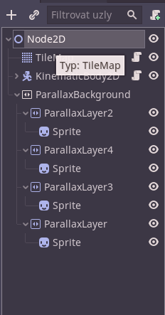

## What is a parallax background?

Parallax is a effect you can use for your background
in your 2D platformer game. You can make layers of background images,
each of them can scroll in a different speed. That creates a nice
illusion of depth. Take a look at this video:


<video loop autoplay="autoplay" muted width="100%">

    <source src="preview.webm"
            type="video/webm">

    Sorry, your browser doesn't support embedded videos.
</video>


As you can see, we have drawn several layers of background in our game Vagos Dream,
and then used the godot ParallaxBackground node to handle the scrolling.
It looks really nice.

## Setting it up in godot

The basic setup is very easy, it's only hard to tweak it doesn't
look buggy. We will do that later.

You need to have a moving camera, for example a player, that has a Camera2D in it.
The ParallaxBackground node will scroll automatically knowing the location
of the camera.

1. First, add a `ParallaxBackground` node, ideally as a child to your root node.
2. Then start adding `ParallaxLayer`s as a child of it and always
add a sprite with your background layer texture as a child to it.
3. Now for each parallaxlayer, in the motion category, you can set the scale
parameters. 0 would mean it wouldn't move at all, 0.5 would mean half the speed of the player, etc etc.

The result scene could look something like this:


Now, you can either tweak the ParallaxLayers manually, or skip to my [ParallaxLayer script](#parallaxlayer-script-that-sets-it-for-you) that sets it for you.

### Configure ParallaxLayers manually

Now you need to tell godot at what position it should mirror/repeat the sprite. You do
that by entering image size into the "Mirroring" parameter of the
ParallaxLayer. If you want to mirror it on the y axis aswell, you must define y
mirroring too.

Also, if you made the sprite scale bigger, you must multiply
the mirroring numbers by your sprite scale.

#### Dealing with weird glitches

I've encountered weird glitching at this point. In my understanding it does that
when your whole sprite size is still smaller than your viewport size.

The workaround is to make the sprite bigger by repeating it using region rects.
Steps you need to do:
1. in the sprites, in the region category, enable it and set the width and height
to a multiple of your sprite texture size that is bigger than your screen.
2. Set the mirroring in the ParallaxLayers again, according to the Sprite rect's size.
3. Import your textures again, now with the "Repeat" flag set to enabled.

### ParallaxLayer script that sets it for you!
I was lazy to do the long setup for each ParallaxLayer, so I made this script that
does all the setup. So you only need to assign a texture to the
ParallaxLayer's sprite, add this script to all the ParallaxLayer and that's all.

```gdscript
extends ParallaxLayer

onready var camera = get_tree().current_scene.get_node("Player/Player/Camera2D")
export (int) var sprite_scale = 4
export (bool) var y_mirroring = false

var last_screen_size = Vector2()
func _process(_delta):
	var screen_size = get_viewport_rect().size * camera.zoom
	if screen_size != last_screen_size:
		var sprite = get_children()[0]
		sprite.scale = Vector2(sprite_scale, sprite_scale)
		var sprite_size = sprite.get_rect().size
		var rect = Rect2(0, 0, sprite_size.x * ceil(screen_size.x / sprite_size.x/sprite_scale),
		 sprite_size.y)
		sprite.region_rect = rect
		sprite.region_enabled = true
		motion_mirroring = Vector2(rect.size.x*sprite_scale, 0)
		if y_mirroring:
			rect.size.y = sprite_size.y * ceil(screen_size.y / sprite_size.y/sprite_scale)
			sprite.region_rect = rect
			motion_mirroring.y = rect.size.y*sprite_scale
	last_screen_size = screen_size
```

It automatically adjusts everything based on your sprite size, screen size,
camera zoom
and your desired sprite scale.
You must adjust the camera path based on your scene.
Also, you can play with the sprite scale, to make your whole
background bigger or smaller.
