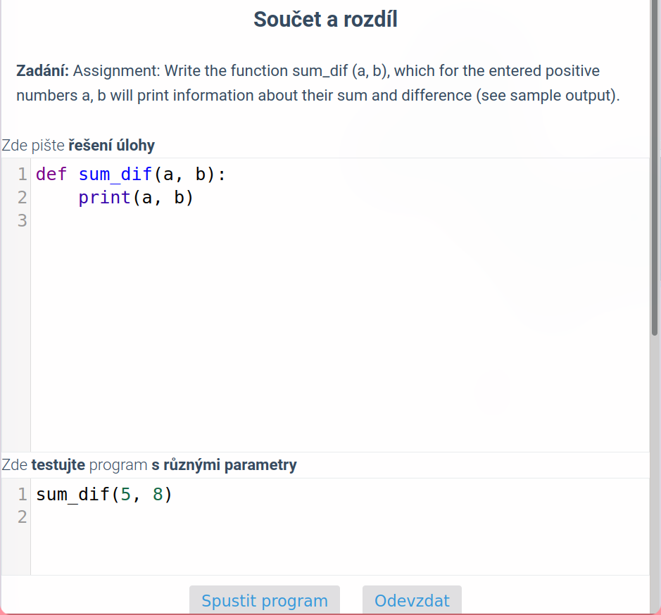

---

title: "Teaching zoomers how to code"
date: 2021-03-30T12:30:03+02:00
author: "Me"
tags: ["thoughts"]
showToc: true
TocOpen: false
draft: false
hidemeta: false
comments: true
description: "I'm teaching a programming 'club' in my school. This is the second year.
Still figuring out how to do it perfectly."
disableHLJS: true
disableShare: true
searchHidden: true

---

## The problems

A lot of kids (12-13yo) start to attend my lessons because they think they want
to do programming but then they come and start minecraft instead of focusing
just a little bit. It's hard to tear them away from it because I am not
the type of person that would force them to do something.

### Getting their focus

It's hard to make kids focus to anything. They want to do fun stuff,
and coding basics in Python may not seem just as fun as Minecraft
to the average kid. I know it myself, when I think something is
boring, I don't focus at all - We are forced to attend classes
like Czech language so I know my things.

I think coding may seem like some complicated raw logic at the
first glance, but when you start solving some problems yourself,
the joy comes.

## What exactly to do with them?

Text based programming can be boring for younger kids.
Unfortunately they are used to imeddiate visual response to things.
When writing code, they struggle to process it, because their minds
aren't acustomed yet to the programming mindset of instructions.

They always tell me they want to make games. But I think they have
to learn some basic programming concepts first. They don't
really want to do that.

But if I started making games right off they would just have to
blindly copy the things that I write without even thinking.
That's not really beneficial for them.

### Scratch

Scratch is fun. They like it, because they can easily make a game
without writing code. It's best for the youngest kids, who would
be scared from normal code. They'll maybe learn the basic programming
concepts, like step-by-step instructions, loops, variables etc.

The drawback is that it isn't real programming at all. Doing scratch
again and again can be a little bit contra productive, because
scratch uses some weird programming concepts that you don't see
anywhere else, like events.

So fun but too easy.

### Python basics and playing with python

So I make them install python or we go to repl.it and I show them
the most basic stuff and we always play with the thing I showed them.

When they start to get it, I move to more complex things like for loops etc.

I am tring to teach them that you don't generally need an IDE to code.
You're enough with a notepad,
a command line, and a python environment installed.

Pros:

- I feel they enjoy when I am explaining it myself
- They like when it is simple

Cons:

- They are scarred of errors and exceptions ->
- They can't google ->
- Most of them aren't able solve primitive problems themselves

### Sites with tasks and python repl

We use a czech site [umimeprogramovat.cz](https://umimeprogramovat.cz/).
They have lots of types of tasks, graphical things and real coding things.
We mainly do some tasks in the python programming category.

I like the site very much. I actually learned coding basics on it 3 years ago.
At start, they'll give you very easy tasks. Python is easy so you'll eventually
figure it yourself. I think this is a very good approach, just making you
do tasks which you will figure yourself.

Pros:

- very good tasks
- can confirm it worked for me

Cons:

- the dumber kids don't focus, because they find text only problems boring
- they should make it more clear that you are writing a general
function/procedure that solves it for any parameters you ask it to.
I didn't understand that when I was doing it to learn python. It was a little
weird that they splitted the code into two parts - function and testing.
When in reality if you'd like to run the code yourself you would have
to type both things into one file.

#### When it started to click for me

Three years ago, our school's IT teacher was teaching the programming
club. He always showed the site, opened up a problem and
called some kid to solve it. He was always like "Lukáš, go solve this,
this is too easy for you haha" but in reality, I didn't understand
python at all. So I always typed in some random things. I was always
remembering how to do the for range, it was always corrupted in my memory :D

But one day, I tried to solve some problems myself, it went good, and I really
started to understand it.

### Making games with them

So when my kids could handle scratch and python basics, I decided
we will finally make a game!

My first choice was to try the python module `pygame`.
I would not recommend using that with kids for anyone. You are doing
everything in code, like loading images, moving them etc. Can be boring.

This year I showed them the Godot engine and they really liked it (so do I).
The best thing is that it has a nice GUI editor to edit scenes. So kids
can setup their sprites and bodies without even writing code.

Then the coding is easy too. You write in a language called GDScript, which
is something like python, but with `var` defined variables and `func` defined functions.

We are now quarantined so the lessons are happening on Google Meet. We've already
made a few 2D pixel art games. It seems that they enjoy it :)

## Things I push into them

1. You don't have to memorize anything. You just google.
Learn how to google. Learn english.
2. Think about the code you copy from me. Analyze it.
Try to do something yourself at home. Make something small.
3. It's good to learn to type a little bit faster. Also, please
use the English keyboard layout.
4. Do your own thing! Code something small at home. That's the best
strategy.
	1. Unfortunately they are lazy gamers at home. idk

## I want your input

Do you teach kids? Please share how you handle it or what you do in the comments.
I want to hear other people's experiences.
